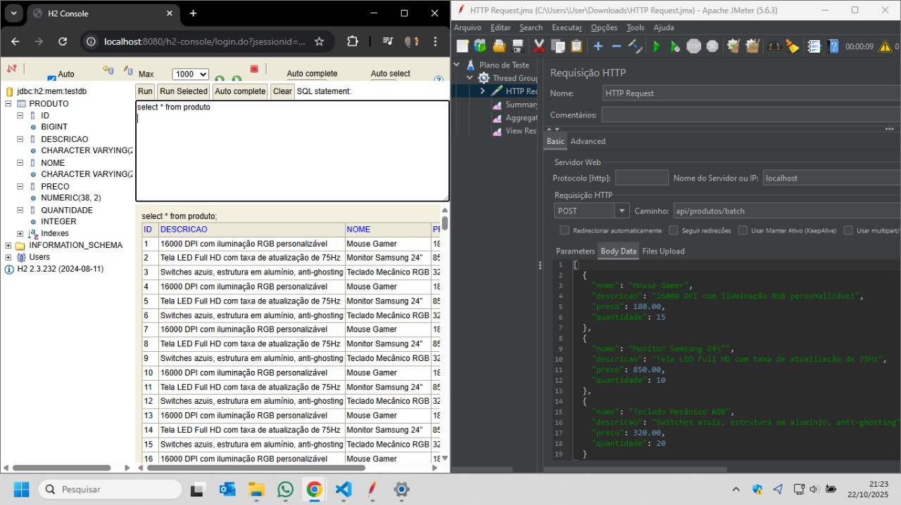
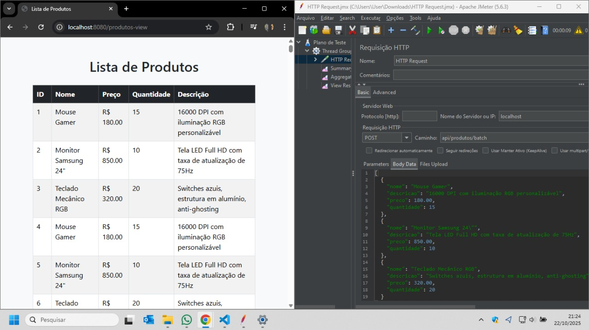
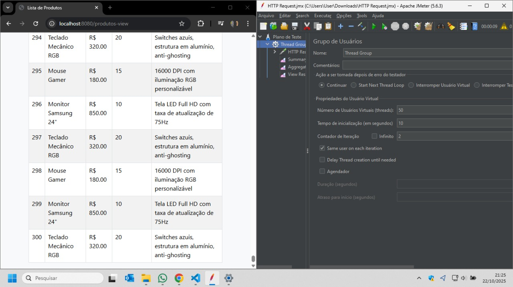

[README.md](https://github.com/user-attachments/files/23040492/README.md)
#  Trabalho Mockito & JMeter

Projeto desenvolvido como atividade prática para demonstração de **testes automatizados** em aplicações **Spring Boot**.  
O sistema combina **testes unitários com Mockito** e **testes de performance com Apache JMeter**, abordando as boas práticas de validação e medição de desempenho de APIs REST.

---

##  Descrição

Este projeto é um **sistema exemplo de cadastro de produtos**, construído com **Spring Boot 3.5.6**, utilizando **H2 Database** como banco em memória.  
A aplicação fornece endpoints REST para operações CRUD, e os testes foram implementados em duas frentes:

- **Mockito**: para criação de testes unitários simulando dependências.  
- **Apache JMeter**: para avaliar desempenho e carga sobre os endpoints HTTP expostos.

---

##  Tecnologias Utilizadas

| Categoria | Ferramenta |
|------------|-------------|
| Backend | Spring Boot 3.5.6 |
| Linguagem | Java 17 |
| Testes Unitários | JUnit 5 + Mockito |
| Banco de Dados | H2 (em memória) |
| Testes de Performance | Apache JMeter |
| Build Tool | Maven |
| Outros | Lombok, Spring Data JPA |

---

##  Estrutura do Projeto

```
Trabalho-Mockito-JMeter/
│
├── pom.xml                  # Configuração Maven (Spring Boot, Mockito, JPA, etc.)
├── src/
│   ├── main/java/com/example/produtoTeste/
│   │   ├── model/           # Entidades JPA
│   │   ├── repository/      # Interfaces de persistência
│   │   ├── controller/      # Endpoints REST
│   │   └── service/         # Regras de negócio
│   └── test/java/com/example/produtoTeste/
│       ├── mocks/           # Testes com Mockito
│       └── ...              # Demais classes de teste
│
├── HTTP Request.jmx         # Script de requisições HTTP no JMeter
├── Summary Report.jmx       # Relatório consolidado de desempenho
└── README.md
```

---

##  Como Executar o Projeto

###  Pré-requisitos

- Java 17 ou superior  
- Maven instalado (ou usar o wrapper `mvnw`)  
- Apache JMeter (para os testes de performance)

---

###  Passos para rodar a aplicação

1. **Clone o repositório:**
   ```bash
   git clone https://github.com/DiegoMorpheus/Trabalho-Mockito-JMeter.git
   cd Trabalho-Mockito-JMeter
   ```

2. **Compile e execute:**
   ```bash
   ./mvnw spring-boot:run
   ```
   A aplicação estará disponível em:  
    [http://localhost:8080](http://localhost:8080)

3. **Banco de dados H2:**  
   Acesse o console H2 em [http://localhost:8080/h2-console](http://localhost:8080/h2-console)  
   - JDBC URL: `jdbc:h2:mem:testdb`  
   - Usuário: `sa`  
   - Senha: *(vazio)*

---

##  Testes Unitários com Mockito

Para executar os testes unitários:

```bash
./mvnw test
```

Esses testes utilizam **Mockito** para simular dependências das camadas de serviço e repositório, garantindo a correta integração das classes sem dependência real de banco de dados.

---

##  Testes de Performance com JMeter

O projeto contém dois arquivos `.jmx`:

- **`HTTP Request.jmx`** → Executa requisições HTTP simulando múltiplos usuários.  
- **`Summary Report.jmx`** → Gera um resumo consolidado de tempos de resposta e throughput.

###  Executar no JMeter:

1. Abra o **Apache JMeter**.  
2. Vá em **File → Open** e selecione `HTTP Request.jmx`.  
3. Ajuste o número de threads (usuários virtuais) e ramp-up time conforme desejado.  
4. Execute o teste.  
5. Abra o `Summary Report.jmx` para visualizar os resultados agregados.  

---

##  Dependências principais (`pom.xml`)

```xml
<dependencies>
  <dependency>
    <groupId>org.springframework.boot</groupId>
    <artifactId>spring-boot-starter-data-jpa</artifactId>
  </dependency>
  <dependency>
    <groupId>org.springframework.boot</groupId>
    <artifactId>spring-boot-starter-web</artifactId>
  </dependency>
  <dependency>
    <groupId>org.springframework.boot</groupId>
    <artifactId>spring-boot-starter-test</artifactId>
    <scope>test</scope>
  </dependency>
  <dependency>
    <groupId>com.h2database</groupId>
    <artifactId>h2</artifactId>
  </dependency>
  <dependency>
    <groupId>org.projectlombok</groupId>
    <artifactId>lombok</artifactId>
  </dependency>
</dependencies>
```
### Apresentando os dados no Banco H2 e o que foi inserido pelo JMeter.

### Mostrando como o JMeter inseriu os dados e como ficou na tela.

### Mostrndo que o JMeter enviou um body com 3 dados, 50 inserções, 2 vezes.

---

##  Autor

**Diego Jardim de Oliveira**  
email: diego.morfeu@gmail.com
Github: https://github.com/DiegoMorpheus

---


